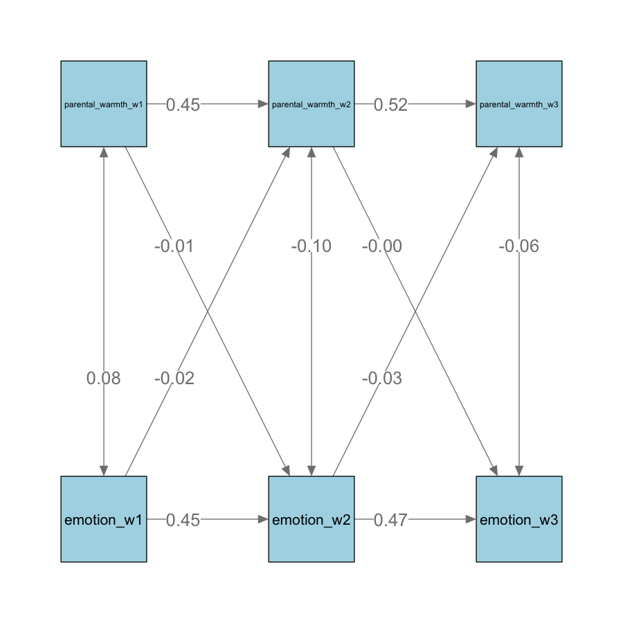

# 1. Background Information

The transition from primary to secondary school is a pivotal period marked by substantial changes in the school environment, social interactions, and academic expectations, as it can affect students' health outcomes and development. Children often experience mixed emotions during this time: they look forward to increased freedom and new friendships but also express concerns about peer relationships, getting lost, and the anxiety associated with a heavier course workload (Zeedyk et al., 2003). These heightened worries align with the onset of anxiety disorders, which become more prominent in early adolescence. In addition to emotional challenges, behavioural factors like self-control significantly impact how well children adjust to secondary school. A longitudinal study found that children with better self-control adapted more successfully to the secondary education environment and achieved higher grades in English, math, and science (Ng-Knight et al., 2016). Given the close link between emotional and behavioural outcomes and successful transitions, exploring how environmental factors, specifically parental and peer support, can enhance these outcomes and facilitate a smoother transition is beneficial.

## Parental Support and Transition

Environmental factors can significantly impact the school transition process. Among these, parental support and peer support are the most accessible and direct facilitators for transitioning children and adolescents. Parental support, in particular, influences both emotional and behavioural outcomes. Numerous studies have highlighted the protective role of parental warmth against anxiety and depression in adolescence. For instance, one study found that youth-reported parental warmth predicted lower internalizing scores and reduced subgenual anterior cingulate (sgACC) responses to criticism during fMRI scans (Butterfield et al., 2020). This protective effect of parental warmth against psychological issues is consistent across cultural groups (Rothenberg et al., 2020).

Self-control, a pivotal behavioural outcome, is the ability to resist temptation and develops from early childhood through adolescence. A study examining family behaviour as a source of self-control found that adolescents' self-control varies with family structure: children living with two biological parents and receiving more parental support reported higher self-control than those living with a single biological parent (Phythian et al., 2008). Moreover, another study found that parental support could alleviate the link between low self-control and deviant behaviour, suggesting that parental support could serve as a potential intervention measure (Boyd & Higgens, 2006).

## Peer Support and Transition

Likewise, research has consistently shown that peer support is associated with better adjustment to secondary school with peer support as a significant protective factor for mental and emotional well-being by helping children cope with stress during the primary-secondary school transition (Virtanen et al., 2019). In fact, studies have shown that peer support effectively buffers negative emotions and enhances emotional well-being where imagining support from a peer reduced negativity ratings in participants compared to self-focused reflection (Pei et al., 2023). A neural signature associated with social support was identified, involving brain regions such as the dorsomedial prefrontal cortex (DMPFC), precuneus, temporoparietal junction (TPJ), and the superior frontal gyrus. This signature was linked to lower negative affect and better emotion regulation, correlating with higher life satisfaction and lower loneliness. These regions are part of the social cognition and cognitive control networks, highlighting their role in processing social interactions and regulating emotions.

The transition from primary to secondary school is a pivotal period where children navigate changes in their social environments and relationships, which can also significantly influence their behavioural outcomes such as self-control. Research underscores the increasing attachment to peers and the stability in victimization across the transition, highlighting the profound role of peer relationships in shaping behavioral outcomes (Lorijn, 2024). Moreover, interventions such as peer mentoring programs have been identified as effective strategies to support children's transition and promote self-control during this period.

## Research Significance

As children grow older, their peer relationships often become more important, and the impact of parental support may decrease. One study found that parental support effectively reduced stress in 9 to 10-year-olds, but it had no significant effect on 15 to 16-year-olds (Hostinar et al., 2015). Since this age range includes the transition to secondary school, it’s important to investigate whether parental support has less of a positive impact on transitioning children during this period.

It's equally important to explore the effects of peer support during this transitional phase. As children enter adolescence, they increasingly rely on their peers for social and emotional support, which plays a critical role in their well-being and may offset the diminishing influence of parental support. Understanding how peer support influences stress reduction, social adjustment, and overall well-being can provide a more comprehensive view of the factors contributing to successful transitions during this critical period. This insight is essential for developing effective interventions and support systems tailored to the evolving needs of growing children.

Furthermore, limited research focuses on the longitudinal effects of parental and peer support on emotional and behavioral outcomes. By using a cross-lag model, this study aims to capture the dynamic nature of emotional and self-control development by revealing bidirectional influences. It shows whether parental and peer support leads to better emotional regulation and self-control or if those traits attract more support and how these relationships evolve, identifying critical periods for interventions. This approach can reveal specific moments when students are most vulnerable or most receptive to support, allowing educators and policymakers to design timely and relevant interventions.

## Research Questions

How do parental and peer support at the start of secondary school independently and interactively predict emotional symptoms and self-control in children transitioning from Year 6 through the first two years of secondary school?

i.  How does parental support in Year 6, the first year of secondary school, and the second year of secondary school affect the emotional symptoms and self-control of students during their transition from primary to secondary education?

ii. How does peer support in Year 6, the first year of secondary school, and the second year of secondary school influence the emotional symptoms and self-control of students during their transition from primary to secondary education?

## Hypothesis

-   Higher levels of parental support at the start of secondary school would predict lower emotional symptoms and better self-control in transitioning children.

-   Higher levels of peer support at the start of secondary school would predict lower emotional symptoms and better self-control in transitioning children.

# 2. Methods

## Design

IV: Parental support and Peer support

DV: Emotional Symptoms and Self-Control

Data was collected in three stages at 6-month intervals:

-   Wave 1 (May 2012): Data collected from Year 6 pupils (ages 10-11) before starting secondary school.

-   Wave 2 (November 2012): Data collected from pupils in the first year of secondary school (ages 11-12).

-   Wave 3 (June 2013): Data collected from pupils in the second year of secondary school (ages 12-13).

## Participants

The study involves pupils from mixed non-selective secondary schools in South-East England, UK.

**Demographics:**

| Participants       | N            |
|--------------------|--------------|
| **Total**          | 626          |
| **Gender**         |              |
| Male               | 310          |
| Female             | 316          |
| **Age (in years)** |              |
| Mean (SD)          | 11.22 (3.53) |
| Min                | 10.67        |
| Max                | 11.92        |
| **Ethnicity**      |              |
| White              | 337          |
| Black              | 40           |
| Asian              | 128          |
| Mixed              | 33           |
| Other              | 17           |
| NA                 | 71           |
| **SEN Status**     |              |
| None               | 475          |
| School Action      | 59           |
| School Action Plus | 22           |
| Statement          | 6            |
| NA                 | 64           |

## Measures

For the independent variables, parental support was measured using the IYFP Interaction Rating Scales, where higher scores indicate more frequent expressions of warmth or hostility. Peer support was evaluated using the Loneliness in Children Scale, with higher scores indicating greater loneliness. \n For the dependent variables, Emotional outcomes were assessed through the Strengths & Difficulties Questionnaire's Emotional Symptoms Subscale, where higher scores denote more emotional symptoms. Self-control was measured using the Brief Self-Control Scale, with higher scores indicating better self-control

NA values were handled by removing rows with insufficient non-NA values to compute mean scores for parental warmth, peer support, emotional symptoms, and self-control, ensuring only rows with adequate data were included in the analyses.

# 3. Analysis

## Descriptive Statistics

| **Wave 1**         | Mean (SD)    |
|--------------------|--------------|
| Parental Warmth    | 38.97 (3.66) |
| Peer Support       | 22.73 (6.12) |
| Emotional Symptoms | 1.70 (1.67)  |
| Self-Control       | 3.99 (0.66)  |

| **Wave 2**         | Mean (SD)    |
|--------------------|--------------|
| Parental Warmth    | 38.79 (4.05) |
| Peer Support       | 10.95 (3.17) |
| Emotional Symptoms | 1.66 (1.75)  |
| Self-Control       | 3.87 (0.63)  |

| **Wave 3**         | Mean (SD)    |
|--------------------|--------------|
| Parental Warmth    | 39.31 (3.79) |
| Peer Support       | 17.31 (2.15) |
| Emotional Symptoms | 1.59 (1.56)  |
| Self-Control       | 3.81 (0.64)  |

## Correlation Matrix

The correlations between environmental support variables and emotional and behavioral outcomes are summarized in Table 1. Parental support demonstrated significant associations with better emotional and behavioral outcomes measured concurrently. Specifically, emotional symptoms exhibited weak correlations with parental support at each wave (Wave 1:  r = 0.03; Wave 2: r = -0.02; Wave 3: r = -0.12 ). Self-control displayed consistent positive correlations with parental support at each wave (Wave 1: r = 0.32, p \< .001; Wave 2: r = 0.27, p \< .001; Wave 3: r = 0.23, p \< .001). 

Whereas, emotional symptoms exhibited positive correlations with peer support at each wave (Wave 1: r = 0.26, p \< .001; Wave 2: r = 0.25, p \< .001; Wave 3: r = 0.20, p \< .001), self-control displayed significant negative correlations with peer support at each wave (Wave 1: r = -0.34, p \< .001; Wave 2: r = -0.16, p \< .001; Wave 3: r = -0.17, p \< .01). 

## Cross-lag Models

### i. Parental Support on Emotional Outcome

Model comparison indicates that the unrestricted model fits the observed data better than the unrestricted model, so the unrestricted model is preferred.

\n The relationship between parental support and self-control is shown in the path diagram in Figure 2. Self-control remained relatively stable across all three waves (Wave 2: β = .47, p \< .001; Wave 3: β = .48, p \< .001). However, no cross-lagged effect between parental support and self-control at any wave was significant.

### ii. Parental Support on Self-Control

Model comparison indicates that the unrestricted model fits the observed data better than the unrestricted model, so the unrestricted model is preferred.

\n Self-control exhibited stability across waves (Wave 2: β = 0.47, p \< .001; Wave 3: β = 0.48, p \< .001), indicating that self-control remains relatively stable over time.

The relationship between parental support and self-control is shown in the path diagram in Figure 2. Self-control remained relatively stable across all three waves (Wave 2: β = .47, p \< .001; Wave 3: β = .48, p \< .001). However, no cross-lagged effect between parental support and self-control at any wave was significant.

### iii. Peer Support on Emotional Outcome

Model comparison indicates that the restricted model fits the observed data significantly worse than the unrestricted model (p \<.001), so the unrestricted model is preferred.

\n The relationship between peer support and emotional symptoms is shown in the path diagram in Figure 3. Emotional symptoms remained relatively stable for variable stability across all three waves (β = .55 and .56). Peer support was also stable across waves, with stability coefficients of β = .40 from Wave 1 to Wave 2 and β = -.35 from Wave 2 to Wave 3.

For the cross-lagged effects, peer support at Wave 2 was positively associated with emotional symptoms at Wave 3 (β = .13, p = .00). This effect is unidirectional because emotional symptoms at Wave 2 were not associated with peer support at Wave 3 (β = .04, p = .33). However, emotional symptoms at Wave 1 were not significantly associated with peer support at Wave 2 (β = -.06, p = .16). In contrast, the reverse effect, peer support at Wave 1 positively associated with emotional symptoms at Wave 2, was significant (β = .42, p \< .001).

### iv. Parental Support on Self-Control

Model comparison indicates that the restricted model fits the observed data significantly worse than the unrestricted model (p \<.001), so the unrestricted model is preferred.

\n The relationship between peer support and self-control is shown in the path diagram in Figure 4. Self-control remained relatively stable across all three waves (β = 0.51 and 0.53). Peer support was also stable across waves, with stability coefficients of β = 0.33 from Wave 1 to Wave 2 and β = -0.28 from Wave 2 to Wave 3.

In terms of the cross-lagged effects, peer support at Wave 2 did not show a significant association with self-control at Wave 3 (β = -0.06, p = .19). Similarly, peer support at Wave 1 was not significantly associated with self-control at Wave 2 (β = -0.01, p = .83). Equally, self-control at Wave 1 did not show a significant association with peer support at Wave 2 (β = -0.07, p = .12), and self-control at Wave 2 was not significantly associated with peer support at Wave 3 (β = 0.02, p = .70).

# 4. Discussion

## Parental & Peer Support on Emotional Outcomes

Parental support was associated with reduced emotional symptoms at each wave and predicted them in the third wave. Our finding is consistent with our hypothesis and agrees with many previous literature on the protective effect of parental support on internalizing and externalizing symptoms in children and adolescents (Butterfield et al., 2020; Mccarthy et al., 2005). However, this predictive effect was not found in the transitioning year when the emotional symptoms during transition predicted perceived parental support at the start of secondary school. In other words, pupils’ emotional conditions during transition shape how they perceive and receive parental support, which helps them navigate through social and academic challenges during the first year. This pattern is consistent with the transactional model of parenting, which argues a bidirectional influence between the parent and the child: Children’s internalizing and externalizing problems may encourage patterns to adopt a harsh parenting style, which further contributes to behavioural problems, suggesting a cyclical relationship (Lansford et al., 2018; Tiberio et al., 2016).

Similarly, Peer support at Wave 2 positively influenced emotional symptoms at Wave 3, highlighting the critical role of peer interactions in emotional well-being. However, contradicting the hypothesis, early peer support predicted increased emotional distress at Wave 2, suggesting that peer interactions can also introduce stressors.

Our findings have clear implications for educators and parents. They underline the need for continuous emotional support, active monitoring of peer dynamics, and the creation of positive peer environments. Early interventions during the transition to secondary school are crucial, as they can help prevent the escalation of emotional issues. Educators and parents must guide peer interactions to ensure they are beneficial, as positive peer support is a key factor in determining emotional outcomes.

Furthermore, this aligns with research showing that peer support influences depressive symptoms and mental health, underscoring the importance of early intervention to prevent escalating emotional issues. Peer victimization is a significant risk factor for persistent emotional distress during this period (Morneau‐Vaillancourt et al., 2023).

## Parental & Peer Support on Self-Control

Even though parental support was positively associated with self-control concurrently across all waves, no parental support in the previous wave predicted self-control in the subsequent wave, which is inconsistent with our hypothesis. Likewise, there were no significant cross-lagged effects between peer support and self-control. Peer support at earlier stages did not predict self-control at later stages, nor did self-control predict peer support. These results suggest that while parental and peer support is essential during the transition to secondary school, it does not significantly influence self-control, which is likely influenced by other factors beyond peer dynamics. Therefore, interventions to improve self-control should focus on individual strategies such as self-regulation techniques and personal goal-setting.

These results are consistent with recent evidence indicating that self-control was not positively associated with parental autonomy support but with extrinsic and intrinsic motivation (Celik, 2024). Studies on more mature adolescents in high school and young adult students in college also indicated that intrinsic motivation is a strong predictor of student engagement and academic performance (Delic & Ryan, 2020). Therefore, we speculate that during development, the source of self-control transits from extrinsic to intrinsic factors (e.g., motivation, self-image, etc.), which have long-lasting effects on a range of positive outcomes in adulthood. This process might involve internalizing extrinsic factors, such as expectations from parents or teachers, which might take place gradually during adolescence.

Additionally, it is essential to acknowledge that teacher support could differ from parental and peer support, as teachers can directly help students with academic challenges. In contrast, parents and peers often provide more emotional support. Hence, future studies should look deeper into whether teacher support better predicts behavioural improvements in children and adolescents compared to parental support.

## Implications

Looking at the longitudinal relationship between peer support and emotional and behavioural outcomes is explicitly particularly important during the transition period from primary to secondary school, as it is a critical period where peer relationships are intricately linked to children's social and emotional development. Understanding how parental and peer support influences emotional and behavioural outcomes can provide insights into how peer interactions shape children's well-being.

Moreover, by using a longitudinal approach, which focuses on real-time outcomes rather than retrospective reports, the study is able to capture the immediate impact of peer support and the dynamic changes in emotional and self-control outcomes. This approach offers a more accurate and timely understanding of how peer support influences students during this critical period. By providing support exactly when it is most needed, our research can significantly enhance students' overall well-being and development during their transition to secondary school.

# 5. References

Boyd, R. J., & Higgins, G. E. (2006). Can Parental Support Mediate the Link between Low Self‐Control and Deviance? Criminal Justice Studies, 19(3), 257–273. <https://doi.org/10.1080/14786010600921654>

Butterfield, R. D., Silk, J. S., Lee, K. H., Siegle, G. S., Dahl, R. E., Forbes, E. E., Ryan, N. D., Hooley, J. M., & Ladouceur, C. D. (2021). Parents still matter! Parental warmth predicts adolescent brain function and anxiety and depressive symptoms 2 years later. Development and Psychopathology, 33(1), 226–239. <https://doi.org/10.1017/S0954579419001718>

Çelik, O. (2024). Academic motivation in adolescents: The role of parental autonomy support, psychological needs satisfaction and self-control. Frontiers in Psychology, 15. <https://doi.org/10.3389/fpsyg.2024.1384695>

Hostinar, C. E., Johnson, A. E., & Gunnar, M. R. (2015). Early Social Deprivation and the Social Buffering of Cortisol Stress Responses in Late Childhood: An Experimental Study. Developmental Psychology, 51(11), 1597. <https://doi.org/10.1037/dev0000029>

Lansford, J. E., Rothenberg, W. A., Jensen, T. M., Lippold, M. A., Bacchini, D., Bornstein, M. H., Chang, L., Deater-Deckard, K., Di Giunta, L., Dodge, K. A., Malone, P. S., Oburu, P., Pastorelli, C., Skinner, A. T., Sorbring, E., Steinberg, L., Tapanya, S., Uribe Tirado, L. M., Alampay, L. P., & Al-Hassan, S. M. (2018). Bidirectional Relations Between Parenting and Behavior Problems From Age 8 to 13 in Nine Countries. Journal of Research on Adolescence, 28(3), 571–590. <https://doi.org/10.1111/jora.12381>

Lorijn, S. J., Zwier, D., Laninga-Wijnen, L., Huisman, M., & Veenstra, R. (2024). A New School, a Fresh Start? Change and Stability in Peer Relationships and Academic Performance in the Transition from Primary to Secondary School. Journal of Youth and Adolescence. <https://doi.org/10.1007/s10964-024-01991-y>

Mccarty, C. A., Zimmerman, F. J., Digiuseppe, D. L., & Christakis, D. A. (2005). Parental Emotional Support and Subsequent Internalizing and Externalizing Problems Among Children. Journal of Developmental & Behavioral Pediatrics, 26(4), 267.

Morneau‐Vaillancourt, G., Oginni, O., Assary, E., Krebs, G., Thompson, E. J., Palaiologou, E., Lockhart, C., Arseneault, L., & Eley, T. C. (2023). A cross‐lagged twin study of emotional symptoms, social isolation and peer victimisation from early adolescence to emerging adulthood. Journal of Child Psychology and Psychiatry, 64(11), 1569–1582. <https://doi.org/10.1111/jcpp.13847>

Ng-Knight, T., Shelton, K. H., Riglin, L., McManus, I. C., Frederickson, N., & Rice, F. (2016). A longitudinal study of self-control at the transition to secondary school: Considering the role of pubertal status and parenting. Journal of Adolescence, 50, 44–55. <https://doi.org/10.1016/j.adolescence.2016.04.006>

Pei, R., Courtney, A. L., Ferguson, I., Brennan, C., & Zaki, J. (2023). A neural signature of social support mitigates negative emotion. Scientific Reports, 13(1), 17293. <https://doi.org/10.1038/s41598-023-43273-w>

Phythian, K. (2008). Family Structure and Parental Behavior: Identifying the Sources of Adolescent Self-Control.

Ryan, R. M., & Deci, E. L. (2020). Intrinsic and extrinsic motivation from a self-determination theory perspective: Definitions, theory, practices, and future directions. Contemporary Educational Psychology, 61, 101860. <https://doi.org/10.1016/j.cedpsych.2020.101860>

Tiberio, S. S., Capaldi, D. M., Kerr, D. C. R., Bertrand, M., Pears, K. C., & Owen, L. (2016). Parenting and the development of effortful control from early childhood to early adolescence: A transactional developmental model. Development and Psychopathology, 28(3), 837–853. <https://doi.org/10.1017/S0954579416000341>

Virtanen, T. E., Vasalampi, K., Torppa, M., Lerkkanen, M.-K., & Nurmi, J.-E. (2019). Changes in students’ psychological well-being during transition from primary school to lower secondary school: A person-centered approach. Learning and Individual Differences, 69, 138–149. <https://doi.org/10.1016/j.lindif.2018.12.001>

Zeedyk, M. S., Werritty, I., & Riach, C. (2003). Promoting Emotional Health through a Parenting Support Programme: What Motivates Parents to Enrol? International Journal of Mental Health Promotion, 5(4), 21–31. <https://doi.org/10.1080/14623730.2003.9721915>
