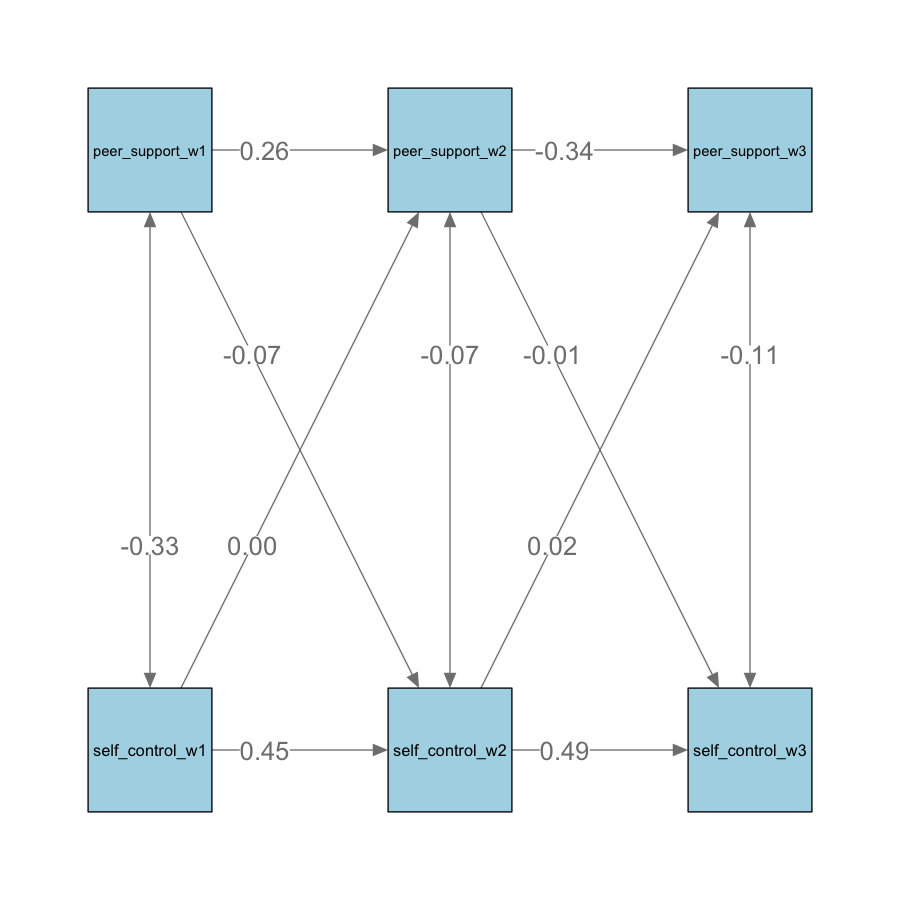

# 1. Background Information

The transition from primary to secondary school is a pivotal period marked by substantial changes in the school environment, social interactions, and academic expectations, as it can affect students' health outcomes and development (Rice et al., 2011). Children often experience mixed emotions during this time: they look forward to increased freedom and new friendships but also express concerns about peer relationships, getting lost, and the anxiety associated with a heavier course workload (Zeedyk et al., 2003). These heightened worries align with the onset of anxiety disorders, which become more prominent in early adolescence (Kessler et al., 2005). In addition to emotional challenges, behavioural factors like self-control significantly impact how well children adjust to secondary school. A longitudinal study found that children with better self-control adapted more successfully to the secondary education environment and achieved higher grades in English, math, and science (Ng-Knight et al., 2016). Given the close link between emotional and behavioural outcomes and successful transitions, exploring how environmental factors, specifically parental and peer support, can enhance these outcomes and facilitate a smoother transition is beneficial.

## Parental Support and Transition

Environmental factors can significantly impact the school transition process. Among these, parental support and peer support are the most accessible and direct facilitators for transitioning children and adolescents. Parental support, in particular, influences both emotional and behavioural outcomes. Numerous studies have highlighted the protective role of parental warmth against anxiety and depression in adolescence. For instance, one study found that youth-reported parental warmth predicted lower internalizing scores and reduced subgenual anterior cingulate (sgACC) responses to criticism during fMRI scans (Butterfield et al., 2020). This protective effect of parental warmth against psychological issues is consistent across cultural groups (Rothenberg et al., 2020).

Self-control, a pivotal behavioural outcome, is the ability to resist temptation and develops from early childhood through adolescence. A study examining family behaviour as a source of self-control found that adolescents' self-control varies with family structure: children living with two biological parents and receiving more parental support reported higher self-control than those living with a single biological parent (Phythian et al., 2008). Moreover, another study found that parental support could alleviate the link between low self-control and deviant behaviour, suggesting that parental support could serve as a potential intervention measure (Boyd & Higgens, 2006).

## Peer Support and Transition

Peer support has also been linked to better adjustment in secondary school and acts as a significant protective factor for children's mental and emotional well-being during the primary-secondary school transition (Lester & Cross, 2015; Virtanen et al., 2019). Studies indicate that peer support effectively mitigates negative emotions and contributes to improved emotional well-being (Pei et al., 2023). For instance, the act of imagining support from a peer led to lower negativity ratings in participants compared to self-focused reflection. Furthermore, a neural signature associated with social support has been identified, encompassing brain regions like the dorsomedial prefrontal cortex (DMPFC), precuneus, temporoparietal junction (TPJ), and the superior frontal gyrus. This signature is linked to reduced negative affect, enhanced emotion regulation, higher life satisfaction, and lower loneliness. Notably, these brain regions are part of the social cognition and cognitive control networks, underscoring their role in processing social interactions and regulating emotions.

Peer support can positively influence behavioural outcomes such as self-control during the primary-secondary school transition. For example, supporting autonomy has positively impacted a child's self-esteem and can contribute to better self-control outcomes during this transition period (Jindal‐Snape et al., 2020).

The transition from primary to secondary school is a pivotal period where children navigate changes in their social environments and relationships, which significantly influence their self-control and behavioural outcomes. Research underscores the increasing attachment to peers and the stability in victimization across the transition, highlighting the profound role of peer relationships in shaping behavioral outcomes (Lorijn, 2024). Moreover, interventions such as peer mentoring programs have been identified as effective strategies to support children's transition and promote self-control during this period (Tsegay et al., 2023).

## Research Significance

As children grow older, their peer relationships often become more important, and the impact of parental support may decrease. One study found that parental support effectively reduced stress in 9 to 10-year-olds, but it had no significant effect on 15 to 16-year-olds (Hostinar et al., 2014). Since this age range includes the transition to secondary school, it’s important to investigate whether parental support has less of a positive impact on transitioning children during this period.

It's equally important to explore the effects of peer support during this transitional phase. As children enter adolescence, they increasingly rely on their peers for social and emotional support, which plays a critical role in their well-being and may offset the diminishing influence of parental support. Understanding how peer support influences stress reduction, social adjustment, and overall well-being can provide a more comprehensive view of the factors contributing to successful transitions during this critical period. This insight is essential for developing effective interventions and support systems tailored to the evolving needs of growing children.

Furthermore, limited research focuses on the longitudinal effects of parental and peer support on emotional and behavioral outcomes. By using a cross-lag model, this study aims to capture the dynamic nature of emotional and self-control development by revealing bidirectional influences. It shows whether parental and peer support leads to better emotional regulation and self-control or if those traits attract more support and how these relationships evolve, identifying critical periods for interventions. This approach can reveal specific moments when students are most vulnerable or most receptive to support, allowing educators and policymakers to design timely and relevant interventions.

## Research Questions

How do parental and peer support at the start of secondary school independently and interactively predict emotional symptoms and self-control in children transitioning from Year 6 through the first two years of secondary school?

i.  How does parental support in Year 6, the first year of secondary school, and the second year of secondary school affect the emotional symptoms and self-control of students during their transition from primary to secondary education?

ii. How does peer support in Year 6, the first year of secondary school, and the second year of secondary school influence the emotional symptoms and self-control of students during their transition from primary to secondary education?

## Hypothesis

-   Higher levels of parental support at the start of secondary school would predict lower emotional symptoms and better self-control in transitioning children.

-   Higher levels of peer support at the start of secondary school would predict lower emotional symptoms and better self-control in transitioning children.

# 2. Methods

## Design

IV: Parental support and Peer support

DV: Emotional Symptoms and Self-Control

Data was collected in three stages at 6-month intervals:

-   Wave 1 (May 2012): Data collected from Year 6 pupils (ages 10-11) before starting secondary school.

-   Wave 2 (November 2012): Data collected from pupils in the first year of secondary school (ages 11-12).

-   Wave 3 (June 2013): Data collected from pupils in the second year of secondary school (ages 12-13).

## Participants

The study involves pupils from mixed non-selective secondary schools in South-East England, UK.

**Demographics:**

| Participants   | N    |
|--------------------|--------------|
| **Total**    | 626 |
| **Gender**     |  |
| Male | 310  |
| Female       | 316  |
| **Age (in years)**     |  |
| Mean (SD) | 11.22 (3.53)  |
| Min       | 10.67  |
| Max       | 11.92  |

## Measures

(need to add)

# 3. Analysis

## Descriptive Statistics

| **Wave 1**         | Mean (SD)    |
|--------------------|--------------|
| Parental Warmth    | 37.51 (5.73) |
| Peer Support       | 25.12 (9.57) |
| Emotional Symptoms | 2.11 (2.08)  |
| Self-Control       | 3.88 (0.71)  |

| **Wave 2**         | Mean (SD)    |
|--------------------|--------------|
| Parental Warmth    | 37.05 (6.47) |
| Peer Support       | 17.19 (3.18) |
| Emotional Symptoms | 2.15 (2.14)  |
| Self-Control       | 3.72 (0.68)  |

| **Wave 3**         | Mean (SD)    |
|--------------------|--------------|
| Parental Warmth    | 37.56 (6.57) |
| Peer Support       | 17.19 (3.18) |
| Emotional Symptoms | 2.15 (2.14)  |
| Self-Control       | 3.72 (0.68)  |

## Correlation Matrix


The correlations between environmental support variables and emotional and behavioural outcomes are summarised in Table 1. Parental support demonstrated significant associations with better emotional and behavioural outcomes measured concurrently. Specifically, emotional symptoms exhibited negative correlations with parental support at each wave (Wave 1: r = -.11, p = .03; Wave 2: r = -.18, p \< .001; Wave 3: r = -0.22, p \< .01). Similarly, self-control displayed consistent positive correlations with parental support at each wave (Wave 1: r = .25, p \< .001; Wave 2: r = .25, p \< .001; Wave 3: r = .27, p \< .001).

Likewise, emotional symptoms exhibited positive correlations with peer support at each wave (Wave 1: r = 0.45, p \< .001; Wave 2: r = 0.41, p \< .001; Wave 3: r = 0.24, p \< .001). Similarly, self-control displayed negative correlations with peer support at each wave (Wave 1: r = -0.38, p \< .001; Wave 2: r = -0.25, p \< .001; Wave 3: r = -0.08, p \< .01).

## Cross-lag Models

### i. Parental Support on Emotional Outcome

```         
m1_urs <- "
  parental_warmth_w3 ~ 1 + emotion_w2 + parental_warmth_w2
  emotion_w3 ~ 1 + parental_warmth_w2 + emotion_w2
  parental_warmth_w2 ~ 1 + emotion_w1 + parental_warmth_w1
  emotion_w2 ~ 1 + parental_warmth_w1 + emotion_w1

  parental_warmth_w2 ~~ emotion_w2
  parental_warmth_w3 ~~ emotion_w3
  parental_warmth_w1 ~~ emotion_w1
"

m1_urs <- sem(m1_urs, data = final_df)
summary(m1_urs)

m1_rs <- "parental_warmth_w3 ~ 1 + emotion_w2 + a*parental_warmth_w2
          emotion_w3 ~ 1 + parental_warmth_w2 + b*emotion_w2
          parental_warmth_w2 ~ 1 + emotion_w1 + a*parental_warmth_w1
          emotion_w2 ~ 1 + parental_warmth_w1 + b*emotion_w1

          parental_warmth_w2 ~~ emotion_w2
          parental_warmth_w3 ~~ emotion_w3
          parental_warmth_w1 ~~ emotion_w1"

m1_rs <- sem(m1_rs, data = final_df)
summary(m1_rs)

anova(m1_urs, m1_rs) 
```

Model comparison indicates that the restricted model fits the observed data significantly worse than the unrestricted model (p \<.001), so the unrestricted model is preferred.


\n The relationship between parental support and emotional symptoms is shown in the path diagram in Figure 1. For variable stability, emotional symptoms remained relatively stable across all three waves (β = .57 and .56). Parental support was more stable in the first year of secondary school (β = .70) than in the transitioning year (β = .48). For the cross-lagged effect, parental support at wave 2 was negatively associated with emotional symptoms at wave 3 (β = -.131, p \< .001). This effect is unidirectional because emotional symptoms at wave two were not associated with parental support at wave 3 (p = .85). However, in the transitioning year, the emotional symptoms at wave one were negatively associated with parental support at wave 2 (β = -.14, p \< .001) while the reverse effect was not significant (p = .90)

### ii. Parental Support on Self-Control

```         
m2_urs <- "parental_warmth_w3 ~ 1 + self_control_w2 + parental_warmth_w2
          self_control_w3 ~ 1 + parental_warmth_w2 + self_control_w2
          parental_warmth_w2 ~ 1 + self_control_w1 + parental_warmth_w1
          self_control_w2 ~ 1 + parental_warmth_w1 + self_control_w1

          parental_warmth_w2 ~~ self_control_w2
          parental_warmth_w3 ~~ self_control_w3
          parental_warmth_w1 ~~ self_control_w1"

m2_urs <- sem(m2_urs, data = final_df)
summary(m2_urs)

m2_rs <- "parental_warmth_w3 ~ 1 + self_control_w2 + a*parental_warmth_w2
          self_control_w3 ~ 1 + parental_warmth_w2 + b*self_control_w2
          parental_warmth_w2 ~ 1 + self_control_w1 + a*parental_warmth_w1
          self_control_w2 ~ 1 + parental_warmth_w1 + b*self_control_w1

          parental_warmth_w2 ~~ self_control_w2
          parental_warmth_w3 ~~ self_control_w3
          parental_warmth_w1 ~~ self_control_w1"

m2_rs <- sem(m2_rs, data = final_df)
summary(m2_rs)

anova(m2_urs, m2_rs) 
```

Model comparison indicates that the restricted model has a better fit to the observed data than the unrestricted model, so the restricted model is used.


\n The relationship between parental support and self-control is shown in the path diagram in Figure 2. Self-control remained relatively stable across all three waves (β = .55 and .57). However, no cross-lagged effect between parental support and self-control at any wave was significant.

### iii. Peer Support on Emotional Outcome

```         
m3_pse <- "peer_support_w3 ~ 1 + emotion_w2 + peer_support_w2
          emotion_w3 ~ 1 + peer_support_w2 + emotion_w2
          peer_support_w2 ~ 1 + emotion_w1 + peer_support_w1
          emotion_w2 ~ 1 + peer_support_w1 + emotion_w1

          peer_support_w2 ~~ emotion_w2
          peer_support_w3 ~~ emotion_w3
          peer_support_w1 ~~ emotion_w1"

m3_pse <- sem(m3_pse, data = final_df)
summary(m3_pse)
stand_m3 <- standardizedsolution(m3_pse)
stand_m3

m3_pse_restricted <- "peer_support_w3 ~ 1 + emotion_w2 + b*peer_support_w2
                      emotion_w3 ~ 1 + b*peer_support_w2 + c*emotion_w2
                      peer_support_w2 ~ 1 + emotion_w1 + b*peer_support_w1
                      emotion_w2 ~ 1 + b*peer_support_w1 + c*emotion_w1
                      
                      peer_support_w2 ~~ emotion_w2
                      peer_support_w3 ~~ emotion_w3
                      peer_support_w1 ~~ emotion_w1
                      "

m3_pse_restricted <- sem(m3_pse_restricted, data = final_df)
summary(m3_pse_restricted)


anova(m3_pse, m3_pse_restricted)
```

Model comparison indicates that the restricted model fits the observed data significantly worse than the unrestricted model (p \<.001), so the unrestricted model is preferred.


\n The relationship between peer support and emotional symptoms is shown in the path diagram in Figure 3. Emotional symptoms remained relatively stable for variable stability across all three waves (β = .55 and .56). Peer support was also stable across waves, with stability coefficients of β = .40 from Wave 1 to Wave 2 and β = -.35 from Wave 2 to Wave 3.

For the cross-lagged effects, peer support at Wave 2 was positively associated with emotional symptoms at Wave 3 (β = .13, p = .00). This effect is unidirectional because emotional symptoms at Wave 2 were not associated with peer support at Wave 3 (β = .04, p = .33). However, emotional symptoms at Wave 1 were not significantly associated with peer support at Wave 2 (β = -.06, p = .16). In contrast, the reverse effect, peer support at Wave 1 positively associated with emotional symptoms at Wave 2, was significant (β = .42, p \< .001).

### iv. Parental Support on Self-Control

```         
m4_psb <- "peer_support_w3 ~ 1 + self_control_w2 + peer_support_w2
          self_control_w3 ~ 1 + peer_support_w2 + self_control_w2
          peer_support_w2 ~ 1 + self_control_w1 + peer_support_w1
          self_control_w2 ~ 1 + peer_support_w1 + self_control_w1

          peer_support_w2 ~~ self_control_w2
          peer_support_w3 ~~ self_control_w3
          peer_support_w1 ~~ self_control_w1"

m4_psb <- sem(m4_psb, data = final_df)
summary(m4_psb)
stand_m4 <- standardizedsolution(m4_psb)
stand_m4

m4_psb_restricted <- "peer_support_w3 ~ 1 + self_control_w2 + b*peer_support_w2
                      self_control_w3 ~ 1 + b*peer_support_w2 + c*self_control_w2
                      peer_support_w2 ~ 1 + self_control_w1 + b*peer_support_w1
                      self_control_w2 ~ 1 + b*peer_support_w1 + c*self_control_w1
                      
                      peer_support_w2 ~~ self_control_w2
                      peer_support_w3 ~~ self_control_w3
                      peer_support_w1 ~~ self_control_w1
                      "

m4_psb_restricted <- sem(m4_psb_restricted, data = final_df)
summary(m4_psb_restricted)

anova(m4_psb, m4_psb_restricted)
```

Model comparison indicates that the restricted model fits the observed data significantly worse than the unrestricted model (p \<.001), so the unrestricted model is preferred.



\n The relationship between peer support and self-control is shown in the path diagram in Figure 4. Self-control remained relatively stable across all three waves (β = 0.51 and 0.53). Peer support was also stable across waves, with stability coefficients of β = 0.33 from Wave 1 to Wave 2 and β = -0.28 from Wave 2 to Wave 3.

In terms of the cross-lagged effects, peer support at Wave 2 did not show a significant association with self-control at Wave 3 (β = -0.06, p = .19). Similarly, peer support at Wave 1 was not significantly associated with self-control at Wave 2 (β = -0.01, p = .83). Equally, self-control at Wave 1 did not show a significant association with peer support at Wave 2 (β = -0.07, p = .12), and self-control at Wave 2 was not significantly associated with peer support at Wave 3 (β = 0.02, p = .70).

# 4. Discussion

## Parental & Peer Support on Emotional Outcomes

Parental support was associated with reduced emotional symptoms at each wave and predicted them in the third wave. Our finding is consistent with our hypothesis and agrees with many previous literature on the protective effect of parental support on internalizing and externalizing symptoms in children and adolescents (Butterfield et al., 2022; Mccarthy et al., 2005). However, this predictive effect was not found in the transitioning year when the emotional symptoms during transition predicted perceived parental support at the start of secondary school. In other words, pupils’ emotional conditions during transition shape how they perceive and receive parental support, which helps them navigate through social and academic challenges during the first year. This pattern is consistent with the transactional model of parenting, which argues a bidirectional influence between the parent and the child: Children’s internalizing and externalizing problems may encourage patterns to adopt a harsh parenting style, which further contributes to behavioural problems, suggesting a cyclical relationship (Lansford et al., 2018; Tiberio et al., 2016).

Similarly, Peer support at Wave 2 positively influenced emotional symptoms at Wave 3, highlighting the critical role of peer interactions in emotional well-being. However, contradicting the hypothesis, early peer support predicted increased emotional distress at Wave 2, suggesting that peer interactions can also introduce stressors.

Our findings have clear implications for educators and parents. They underline the need for continuous emotional support, active monitoring of peer dynamics, and the creation of positive peer environments. Early interventions during the transition to secondary school are crucial, as they can help prevent the escalation of emotional issues. Educators and parents must guide peer interactions to ensure they are beneficial, as positive peer support is a key factor in determining emotional outcomes.

Furthermore, this aligns with research showing that peer support influences depressive symptoms and mental health, underscoring the importance of early intervention to prevent escalating emotional issues. Peer victimization is a significant risk factor for persistent emotional distress during this period (Morneau‐Vaillancourt et al., 2023).

## Parental & Peer Support on Self-Control

Even though parental support was positively associated with self-control concurrently across all waves, no parental support in the previous wave predicted self-control in the subsequent wave, which is inconsistent with our hypothesis. Likewise, there were no significant cross-lagged effects between peer support and self-control. Peer support at earlier stages did not predict self-control at later stages, nor did self-control predict peer support. These results suggest that while parental and peer support is essential during the transition to secondary school, it does not significantly influence self-control, which is likely influenced by other factors beyond peer dynamics. Therefore, interventions to improve self-control should focus on individual strategies such as self-regulation techniques and personal goal-setting.

These results are consistent with recent evidence indicating that self-control was not positively associated with parental autonomy support but with extrinsic and intrinsic motivation (Celik, 2024). Studies on more mature adolescents in high school and young adult students in college also indicated that intrinsic motivation is a strong predictor of student engagement and academic performance (Delic & Ryan, 2020). Therefore, we speculate that during development, the source of self-control transits from extrinsic to intrinsic factors (e.g., motivation, self-image, etc.), which have long-lasting effects on a range of positive outcomes in adulthood. This process might involve internalizing extrinsic factors, such as expectations from parents or teachers, which might take place gradually during adolescence.

Additionally, it is essential to acknowledge that teacher support could differ from parental and peer support, as teachers can directly help students with academic challenges. In contrast, parents and peers often provide more emotional support. Hence, future studies should look deeper into whether teacher support better predicts behavioural improvements in children and adolescents compared to parental support.

## Implications

Looking at the longitudinal relationship between peer support and emotional and behavioural outcomes is explicitly particularly important during the transition period from primary to secondary school, as it is a critical period where peer relationships are intricately linked to children's social and emotional development. Understanding how peer support influences emotional and behavioural outcomes can provide insights into how peer interactions shape children's well-being (Afandi & Ismail, 2022).

Moreover, our longitudinal approach, which focuses on real-time outcomes rather than retrospective reports, enables us to capture the immediate impact of peer support and the dynamic changes in emotional and self-control outcomes. This approach offers a more accurate and timely understanding of how peer support influences students during this critical period. By providing support exactly when it is most needed, our research can significantly enhance students' overall well-being and development during their transition to secondary school.

# 5. References
