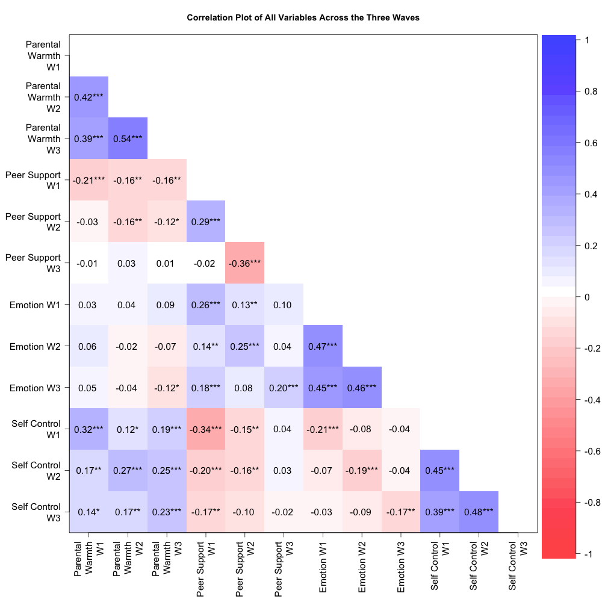
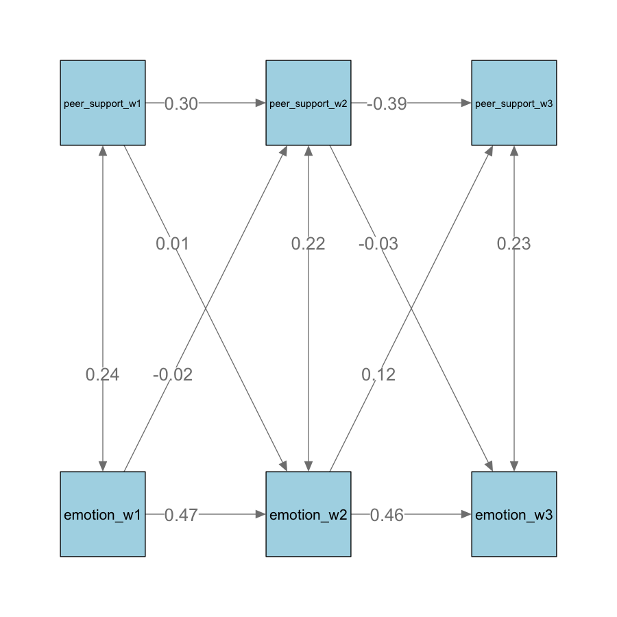

# 1. Background Information

The transition from primary to secondary school is a pivotal period marked by substantial changes in the school environment, social interactions, and academic expectations, as it can affect students' health outcomes and development (Zeedyk et al., 2003). Plenty of past literature has shown that support from parents and friends influences both emotional and behavioral outcomes during transition.  

Specially, Many studies have found that both of them could at as protective factors over emotional problems: Higher levels of parental warmth predicted lower internalizing scores and reduced subgenual anterior cingulate (sgACC) responses in adolescents to criticism during fMRI scans (Butterfield et al., 2020); Likewise, imagination of peer support was more effective than self-reflections in reducing negative emotions and increasing brain social support network including dorsomedial prefrontal cortex (DMPFC), precuneus, temporoparietal junction (TPJ), and the superior frontal gyrus (Pei et al., 2023). As for behavioral outcome, parental and peer support may be beneficial to the development of self-control: Children who live with both biological parents and are more attached to peers tended to have better self-control (Lorijn, 2024 ; Phythian et al., 2008).  

Importantly, the influences of peers and parents are dynamic over development. As children grow older, their peer relationships often become more important, and the impact of parental support may decrease. Therefore, the present study aims to investigate the longitudinal effect of parental and peer support on the emotional and behavioral development in early adolescent pupils during the transitioning year and the first year of secondary school.  

## Research Questions

How do parental and peer support at the start of secondary school independently and interactively predict emotional symptoms and self-control in children transitioning from Year 6 through the first two years of secondary school?

i.  How does parental support affect emotional symptoms and self-control transitioning from primary to secondary school and in the first year of secondary school?  

ii. How does peer support affect emotional symptoms and self-control during transitioning from primary to secondary school and in the first year of secondary school?  

## Hypothesis

-   Higher levels of parental support at the start of secondary school would predict lower emotional symptoms and better self-control in transitioning children.

-   Higher levels of peer support at the start of secondary school would predict lower emotional symptoms and better self-control in transitioning children.

# 2. Methods

## Participants and Measures

We used the questionnaire data from the short-term longitudinal study based on 70 schools in South-east England, UK conducted by Rice et al (2017) from October 2011 to September 2012. All data were collected in three waves separated 6 months apart from each other: 1st wave during the last term of Year 6, 2nd wave during the first term of Year 7, 3rd wave during the last term of Year 7.

**Demographics:**

| Participants       | N            |
|--------------------|--------------|
| **Total**          | 626          |
| **Gender**         |              |
| Male               | 310          |
| Female             | 316          |
| **Age (in years)** |              |
| Mean (SD)          | 11.22 (3.53) |
| Min                | 10.67        |
| Max                | 11.92        |
| **Ethnicity**      |              |
| White              | 337          |
| Black              | 40           |
| Asian              | 128          |
| Mixed              | 33           |
| Other              | 17           |
| NA                 | 71           |
| **SEN Status**     |              |
| None               | 475          |
| School Action      | 59           |
| School Action Plus | 22           |
| Statement          | 6            |
| NA                 | 64           |

The assessed domains we selected for the present study includes:

-   IV1: Parental support was evaluated from relevant items measuring child-perceived parental warmth and hostility in all three waves using the Iowa Youth and Family scale, with higher scores indicating more frequent expressions of warmth or hostility.

-   IV2: Peer support was evaluated from relevant items measuring child-perceived loneliness at school in all three waves using the School Oriented Version of Loneliness in Children scale, with higher scores indicating greater loneliness and less peer support.

-   DV1: Emotional symptoms were evaluated from items measuring child-perceived mental health difficulties in all three waves using the Strength & Difficulties Questionnaire’s Emotional Symptoms Subscale, with higher scores denote more emotional symptoms.

-   DV2: Self-control was evaluated from items measuring child-reported self-control behaviors using the Brief Self-Control Scale in all three waves, with higher scores indicating better self-control.

NA values were handled by removing rows with insufficient valid values to compute mean scores for parental warmth, peer support, emotional symptoms, and self-control, ensuring only rows with adequate data were included in the analyses.

Outliers were removed according to visual inspection of box plots and the interquartile range (IQR) method to ensure that extreme values did not skew the results.

Maximum Likelihood Estimation (MLE) in the cross-lag model was used to accommodate non-normal data distributions to provide more reliable parameter estimates.

The final sample size comprised 467 participants after removing outliers and excluding incomplete data.

# 3. Analysis

## Descriptive Statistics

| **Wave 1**         | Mean (SD)    |
|--------------------|--------------|
| Parental Warmth    | 38.97 (3.66) |
| Peer Support       | 22.73 (6.12) |
| Emotional Symptoms | 1.70 (1.67)  |
| Self-Control       | 3.99 (0.66)  |

| **Wave 2**         | Mean (SD)    |
|--------------------|--------------|
| Parental Warmth    | 38.79 (4.05) |
| Peer Support       | 10.95 (3.17) |
| Emotional Symptoms | 1.66 (1.75)  |
| Self-Control       | 3.87 (0.63)  |

| **Wave 3**         | Mean (SD)    |
|--------------------|--------------|
| Parental Warmth    | 39.31 (3.79) |
| Peer Support       | 17.31 (2.15) |
| Emotional Symptoms | 1.59 (1.56)  |
| Self-Control       | 3.81 (0.64)  |

## Correlation Matrix

The correlations between environmental support variables and emotional and behavioral outcomes are summarized in Table 1. Parental support demonstrated significant associations with better emotional and behavioral outcomes measured concurrently. Specifically, emotional symptoms exhibited weak correlations with parental support at each wave (Wave 1:  r = 0.03; Wave 2: r = -0.02; Wave 3: r = -0.12 ). Self-control displayed consistent positive correlations with parental support at each wave (Wave 1: r = 0.32, p \< .001; Wave 2: r = 0.27, p \< .001; Wave 3: r = 0.23, p \< .001). 

Whereas, emotional symptoms exhibited positive correlations with peer support at each wave (Wave 1: r = 0.26, p \< .001; Wave 2: r = 0.25, p \< .001; Wave 3: r = 0.20, p \< .001), self-control displayed significant negative correlations with peer support at each wave (Wave 1: r = -0.34, p \< .001; Wave 2: r = -0.16, p \< .001; Wave 3: r = -0.17, p \< .01). 

## Cross-lag Models

### i. Parental Support on Emotional Outcome

Model comparison indicates that the unrestricted model fits the observed data better than the unrestricted model, so the unrestricted model is preferred.

\n The relationship between parental support and self-control is shown in the path diagram in Figure 1. Self-control remained relatively stable across all three waves (Wave 2: β = .47, p \< .001; Wave 3: β = .48, p \< .001). However, no co-variances and cross-lagged effect between parental support and self-control at any wave was significant.

### ii. Parental Support on Self-Control

Model comparison indicates that the unrestricted model fits the observed data better than the unrestricted model, so the unrestricted model is preferred.

\n Self-control exhibited stability across waves (Wave 2: β = 0.47, p \< .001; Wave 3: β = 0.48, p \< .001), indicating that self-control remains relatively stable over time.

The relationship between parental support and self-control is shown in the path diagram in Figure 2. Self-control remained relatively stable across all three waves (Wave 2: β = .47, p \< .001; Wave 3: β = .48, p \< .001).

A significant positive covariance is shown between parental warmth and self-control at each wave (Wave 1: β = .32, p \< .001; Wave 2: β = .27, p \< .001; Wave 3: β = .16, p = .013). However, no cross-lagged effect between parental support and self-control at any wave was significant.

### iii. Peer Support on Emotional Outcome

Model comparison indicates that the restricted model fits the observed data significantly worse than the unrestricted model (p \<.001), so the unrestricted model is preferred.

\n The relationship between peer support and emotional symptoms is shown in the path diagram in Figure 3. Emotional symptoms remained relatively stable for variable stability across all three waves, with stability coefficients of β = .46 from Wave 2 to Wave 3 and β = .47 from Wave 1 to Wave 2. On the other hand, peer support was not stable across waves, with stability coefficients of β = .30 from Wave 1 to Wave 2 and β = -.39 from Wave 2 to Wave 3.

A significant positive covariance is also shown between peer support and emotion at each wave (Wave 1: β = .24, p \< .001; Wave 2: β = .22, p \< .001; Wave 3: β = .23, p \< .001).

For the cross-lagged effects, emotional symptoms at Wave 2 were positively associated with peer support at Wave 3 (β = .12, p = .03). This effect is unidirectional because peer support at Wave 2 was not significantly associated with emotional symptoms at Wave 3 (β = -.03, p = .56). However, emotional symptoms at Wave 1 were not significantly associated with peer support at Wave 2 (β = -.02, p = .68), nor was the reverse effect, peer support at Wave 1, not significantly associated with emotional symptoms at Wave 2 (β = .01, p = .92).

### iv. Parental Support on Self-Control

Model comparison indicates that the restricted model fits the observed data significantly worse than the unrestricted model (p \<.001), so the unrestricted model is preferred.

\n The relationship between peer support and self-control is shown in the path diagram in Figure 4. Self-control remained relatively stable across all three waves, with stability coefficients of β = .49 from Wave 2 to Wave 3 and β = .45 from Wave 1 to Wave 2. Peer support did not remain stable across the waves, as indicated by the change in stability coefficients: β = 0.26 from Wave 1 to Wave 2, and β = -0.34 from Wave 2 to Wave 3.

While there was is a significant negative covariance between peer support and self-control in the final year of primary school (β = -.33, p \< .001), the negative covariance was not significant from transition to the first and second years of secondary school (Wave 2: β = -.07, p = .28; Wave 3: β = .-.11, p =.06). No cross-lagged effect between peer support and self-control at any wave was significant.

# 4. Discussion

## Parental & Peer Support on Emotional Outcomes

We found that none of parental support measured in the previous wave predicted subsequent emotional symptoms in any waves. This is contradictory to our hypothesis and some previous literature predicting adolescent internalizing and externalizing symptoms using parental support (Butterfield et al., 2020). However, we did found that peer support at the start of secondary school predicted subsequent emotional symptoms at the end of first year. Taken altogether, our findings suggest that parental relationships might gradually give way to peer relationships in early adolescence: As adolescents experience increased conflicts with parents to seek for independence and autonomy, they become more influenced by peers who they spend increasing amount of time socializing with. This is consistent with studies indicating that while the parental buffering on stress regulation is diminishing, friendships and peer relationships at school was associated with reduced emotional problems (Wang et al., 2024)  

However, both parental and peer support were associated with reduced emotional symptoms concurrently, indicating that positive interpersonal relationships in general might protect children and adolescents from emotional problems, but the contribution of parental support to this effect could be temporary and short-lasting compared to peer support. Our findings highlight the potential of group-based treatment and social skill training in treating adolescent psychological problems.

## Parental & Peer Support on Self-Control

Additionally, we found that even though parental and peer support were associated with self-control concurrently, neither of them measured at the previous wave predicted self-control in the subsequent wave, which is inconsistent with our hypotheses. These results suggest that while extrinsic support is still essential, the development of self-control in adolescents might be more significantly influenced by other intrinsic factors like motivation and self-image, which could have a longer-lasting effect on a range of positive outcomes including academic performance (Delic & Ryan, 2020; Celik et al., 2024). This process might involve internalizing extrinsic factors, such as expectations from parents or teachers, which might take place gradually during adolescence. Our findings highlight the importance of individual-focused strategies such as self-regulation techniques training and personal goal setting.  

## Implications

Looking at the longitudinal relationship between peer support and emotional and behavioural outcomes is explicitly particularly important during the transition period from primary to secondary school, as it is a critical period where peer relationships are intricately linked to children's social and emotional development. Understanding how parental and peer support influences emotional and behavioural outcomes can provide insights into how peer interactions shape children's well-being.

Moreover, by using a longitudinal approach, which focuses on real-time outcomes rather than retrospective reports, the study is able to capture the immediate impact of peer support and the dynamic changes in emotional and self-control outcomes. This approach offers a more accurate and timely understanding of how peer support influences students during this critical period. By providing support exactly when it is most needed, our research can significantly enhance students' overall well-being and development during their transition to secondary school.

# 5. References

Butterfield, R. D., Silk, J. S., Lee, K. H., Siegle, G. S., Dahl, R. E., Forbes, E. E., Ryan, N. D., Hooley, J. M., & Ladouceur, C. D. (2021). Parents still matter! Parental warmth predicts adolescent brain function and anxiety and depressive symptoms 2 years later. Development and Psychopathology, 33(1), 226–239. <https://doi.org/10.1017/S0954579419001718>

Çelik, O. (2024). Academic motivation in adolescents: The role of parental autonomy support, psychological needs satisfaction and self-control. Frontiers in Psychology, 15. <https://doi.org/10.3389/fpsyg.2024.1384695>

Lorijn, S. J., Zwier, D., Laninga-Wijnen, L., Huisman, M., & Veenstra, R. (2024). A New School, a Fresh Start? Change and Stability in Peer Relationships and Academic Performance in the Transition from Primary to Secondary School. Journal of Youth and Adolescence. <https://doi.org/10.1007/s10964-024-01991-y>

Pei, R., Courtney, A. L., Ferguson, I., Brennan, C., & Zaki, J. (2023). A neural signature of social support mitigates negative emotion. Scientific Reports, 13(1), 17293. <https://doi.org/10.1038/s41598-023-43273-w>

Phythian, K. (2008). Family Structure and Parental Behavior: Identifying the Sources of Adolescent Self-Control.

Rice, F., Riglin, L., Ng-Knight, T., Frederickson, N., Shelton, K., & Chris, I. (2017). A longitudinal multi-informant study of psychological adjustment and academic attainment over the transition from primary school to secondary school - ReShare. *Ukdataservice.ac.uk*. <https://reshare.ukdataservice.ac.uk/852714/19/Questionnaires_Pupils_Parents_Teachers.zip>

Ryan, R. M., & Deci, E. L. (2020). Intrinsic and extrinsic motivation from a self-determination theory perspective: Definitions, theory, practices, and future directions. Contemporary Educational Psychology, 61, 101860. <https://doi.org/10.1016/j.cedpsych.2020.101860>

Wang, H., Xu, J., Fu, S., Tsang, U. K., Ren, H., Zhang, S., Hu, Y., Zeman, J. L., & Han, Z. R. (2024). Friend emotional support and dynamics of adolescent socioemotional problems. Journal of Youth and Adolescence.  

Zeedyk, M. S., Werritty, I., & Riach, C. (2003). Promoting Emotional Health through a Parenting Support Programme: What Motivates Parents to Enrol? International Journal of Mental Health Promotion, 5(4), 21–31. <https://doi.org/10.1080/14623730.2003.9721915>
